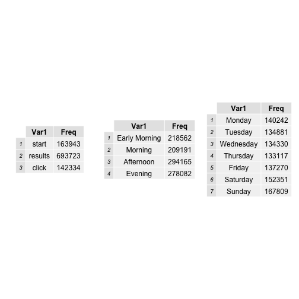
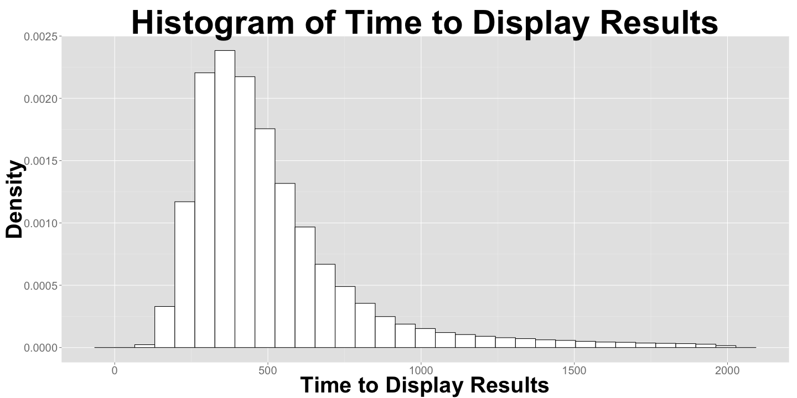
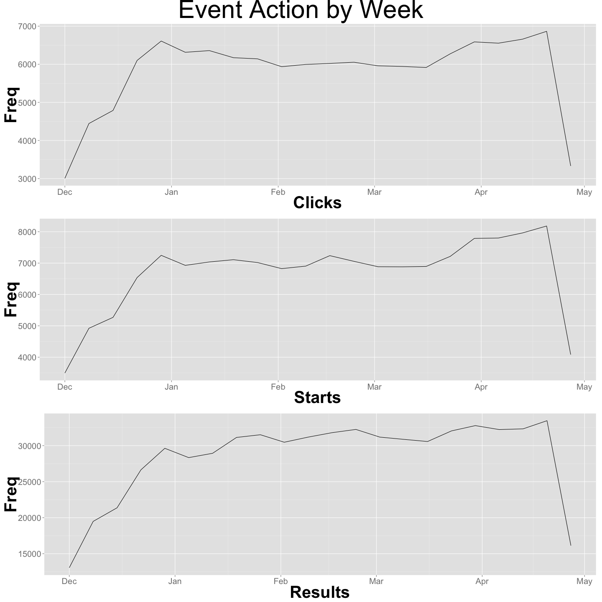

# Data Exploration and Cleaning
In this analysis I will be looking over requests made on Wikimedia. The data set contains 1 million rows of requests made between November 25, 2014 and May 15, 2015.
The purpose of this analysis is going to try and better understand user behavior on Wikimedia over time. In order to facilitate my time based analysis the following data has been added using the `timestamp`.


```r
head(data[,c(4,6,7)])
```

```
## Error in `[.data.frame`(data, , c(4, 6, 7)): undefined columns selected
```


First and foremost I want to get a general idea of the data I will examing by getting a general summary of my quantitative variables, which in this case are `event_timeToDisplayResults` and `timestampe`. 


```r
summary(data[ ,c(1,3)])
```

```
##    timestamp                   event_timeToDisplayResults
##  Min.   :2014-11-25 21:17:51   Min.   : -17501.0         
##  1st Qu.:2015-01-19 15:32:04   1st Qu.:    333.0         
##  Median :2015-02-28 05:14:06   Median :    446.0         
##  Mean   :2015-02-27 07:01:12   Mean   :    755.7         
##  3rd Qu.:2015-04-07 21:33:47   3rd Qu.:    620.0         
##  Max.   :2015-05-15 11:34:39   Max.   :1715767.0         
##  NA's   :204                   NA's   :306277
```

Our `event_timeToDisplayResults` has negative values, which is implausible and seems to be an error in how this data was recorded and there are `timestamp` that are equal to zero. In an attempt to maintain the integrity of the data, I will be remove rows where `event_timeToDisplayResults` $< 0$ and `timesamp` $= 0$.   

In addition to understanding our quantitative variables, I would also like to examine the frequency of our qualitative variables.


```r
grid.arrange(eventactionbar, weekdaybar, monthbar, ncol=3)
```

 

There is  a steady distribution of requests over the week and over every month in our date range, except the months of November and May which is due to our date range falling inbetween these months. When it comes to the distrubition of the types of actions on the website, there are significant amount of result requests compared to start and click requests. This could be a result of users making search queries and not finding their target topic. There was a total of 4.23 result pages served for every start request. 

I wanted to examine this data in greater detail by analyzing changes over the week and clock. I have done this by creating a heat map for the time take to to display a results page. What I did was aggregated the data by hour and weekday and took the median for every interval. The reasoning behind using the median as opposed to the average is because as we saw earlier in the time histogram, there are a lot of our outlying values that could distort our analysis.


```r
resulthistogram
```

 


```r
eventheat
```

 


```r
heataction
```

 

