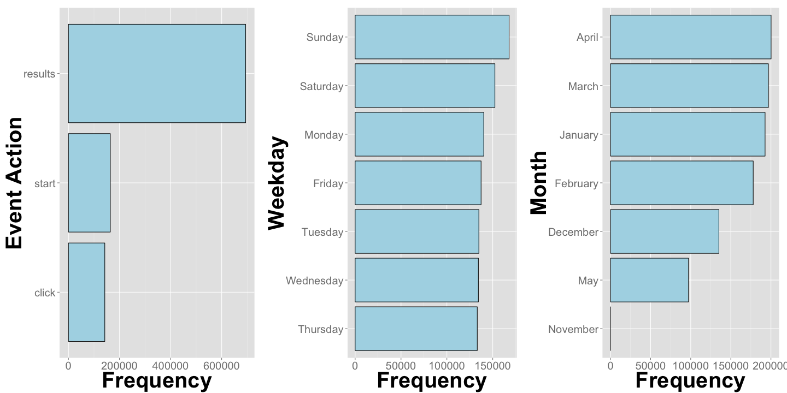

\graphicspath{ {/Users/mmartinez/Desktop/} }

\includegraphics{400px-Wikimedia_Foundation_RGB_logo_with_text.svg.png}


In this analysis I will be reviewing 1 million Wikimedia requests made between November 25, 2014 and May 15, 2015.

The purpose of this analysis is to better understand user behavior on Wikimedia over time. In order to facilitate my time-based analysis the following data has been added using the `timestamp` column.   


```
##    Weekday Hour    Month
## 1 Saturday   08    March
## 2  Tuesday   22    March
## 3 Thursday   20 February
## 4   Sunday   10    April
## 5 Saturday   09 February
## 6 Saturday   22    April
```

First and foremost, I want to get a general idea of the data I will be examining by getting a summary of my quantitative variables, which in this case are `event_timeToDisplayResults` and `timestamp`.   


```
##    timestamp                   event_timeToDisplayResults
##  Min.   :2014-11-25 21:17:51   Min.   : -17501.0         
##  1st Qu.:2015-01-19 15:32:04   1st Qu.:    333.0         
##  Median :2015-02-28 05:14:06   Median :    446.0         
##  Mean   :2015-02-27 07:01:12   Mean   :    755.7         
##  3rd Qu.:2015-04-07 21:33:47   3rd Qu.:    620.0         
##  Max.   :2015-05-15 11:34:39   Max.   :1715767.0         
##  NA's   :204                   NA's   :306277
```

What stands out here is that `event_timeToDisplayResults` has negative values, which is implausible and likely an error in how the data was recorded. There are also `timestamp` dates that are equal to NA. In an attempt to maintain the integrity of the data, I will be removing the rows where `event_timeToDisplayResults` $< 0$ and `timestamp` $= NA$.   

In addition to understanding our quantitative variables, I also want to inspect the frequency of our qualitative variables.

 

There is a steady distribution of requests over the week and over every month in our date range, except for November and May. This is due to our date range falling in-between these months. When it comes to the distribution of the types of actions on the website, there is a substantial difference between result requests and the other two actions, start and click. This might be a consequence of users making search queries and not finding their target topic or it could just be that users are using Wikimedia search several times during a session.

Looking at the data from beginning to end shows that there is a high correlation between the number of clicks, results, and start queries being made. This means that these counts moved in the same direction over time. Another thing to notice is the large jump and fall in December and mid-April across all actions.  

 

One of the prime variables in this analysis is `event_timeToDisplayResults`. This is an important variable because if `event_timeToDisplayResults` is consistently high, users can grow impatient and abandon a webpage. The following histogram shows the distribution of `event_timeToDisplayResults`. For visual purposes I have removed values greater than 2000. These removed values represent only 2.4% of the data.

 

The one thing to notice here is the right skewed distribution caused by extreme values. Given this, if we wanted to summarize this data by using a center measure, the median would be most appropriate since the median is not sensitive to outliers.

I wanted to examine this data in greater detail by analyzing changes over the week and clock. I have done this by creating a heat map for `event_timeToDisplayResults`. What I did here was I aggregated the data by hour and weekday and took the median for each interval. The reasoning behind using the median as opposed to the average is because as we saw earlier in the `event_timeToDisplayResults` histogram, there are a lot of outlying values that could distort this analysis.

The following heat map exposes an interesting insight with respect to `event_timeToDisplayResults` over the week. The insignt is that there is a higher level of `event_timeToDisplayResults` between approximately 6:00AM - 5:00PM. Saturday and Sunday have a slightly lower level of `event_timeToDisplayResults` between this clock time but still follow a similar pattern during the day. 

 

I took same approach when exploring the frequency of requests (results, clicks, and starts) throughout the week. The heat map for this inspection shows us that users are making most of their requests during 12:00PM - 11PM. The highest level of requests occurs during this time on Sunday.

 


<h2 align="center">Recommendations</h2>

After digging into the data, I think there are a few things that need to be investigated further.

* The negative values for `event_timeToDisplayResults`
* The difference in frequency for the different `event_actions`
* The dramatic rise and fall of requests in December and mid-April
* The higher `event_timeToDisplayResults` during 6AM - 5PM
* The reason for high use between 11AM - 10PM

